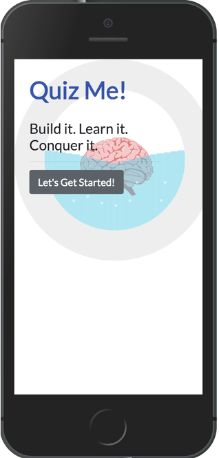
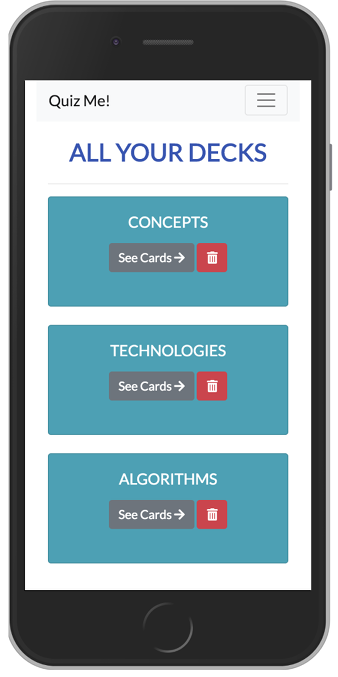
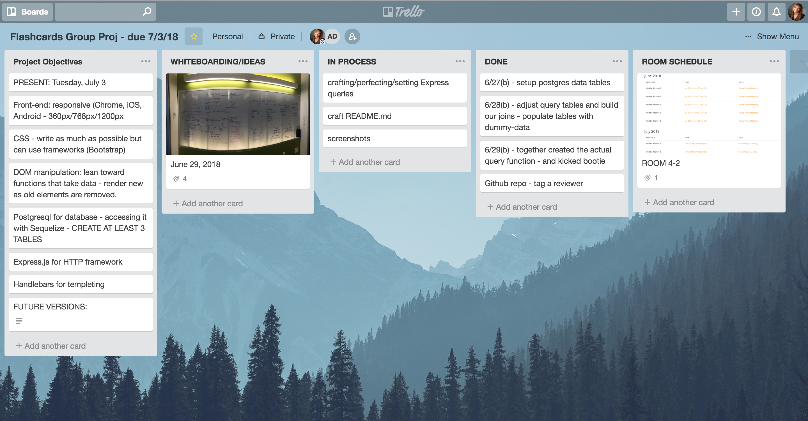

# QuizMe

<p align='center'>
    </img>
</p>

# [Live Demo](https://www.quizzme.com)


## Overview:
QuizMe is a Node.js/Express server-rendered...  Handlebars partials were used to render the front-end views. Settings are stored in a PostgreSQL database. Additions will be made in React.    

##About:
 <p>Create your own cutsom decks of flash cards. Add different cards to each deck. Practice,
            practice, practice. Then, see how much you learned by taking a test!</p>
<p>Our mission is to help new programmers - and master programmers- practice their knowledge of 
            the ever-evoloving languages, concepts, and algorithms of the
            tech world. These can be a struggle when there's so much
            to learn. Add more decks and cards that help you personally.
            We hope this helps clear up all the buzz!
        </p>
<p>
            Beth and Aylin come from non-tech backgrounds. They boldy made the switch
            to tech --insert Star Trek theme music-- and began learning to code. Enrolled in a full-stack bootcamp together, they
            were challenged to think of these concepts in new ways, making analogies and stories to tie it
            all together. This inspired them to help their peers and future students learn these concepts, practice problem-solving,
            and help prepare for white-board interviews.       
        </p>
<p>This is their first Full Stack project.</p>

## Built by:

[Aylin DeBruyne](https://github.com/adebruyne)  
Contributions: Express Routing, Handlebars Templeting, Querying User Preferences, UI/UX Design

[Beth D'Amato](https://github.com/badamato)  
Contributions: PostgreSQL Database Management, Querying User Preferences, AWS Deployment/Management, README.md


## Built with:

* Node.js
* Express
* Handlebars
* PostgreSQL 
* JavaScript
* Bootstrap
* Nginx
* Amazon Web Services Elastic Compute Cloud
* React (coming soon)

<p align='center'>
    </img>
</p>


## Project Whiteboarding

<p align='center'>
    </img>
</p>


## Minimum Viable Product:
**User story:**  I visit the homepage and see a list of decks.  I click on the name of a deck and play a round with that deck.  After the round, I see stats on how well I performed.

**Round description:**  After a user selects a deck, they play a round.  We have specific requirements for what should happen when a user plays a  round.

- The user plays every card in the deck.
- For each card, the user is shown a question to consider.
- After flipping the card, the user is shown the correct answer.
- The round continues until each card is reviewed

**Round statistics description:**  After a user completes a round, the user should be their statistics for the round.  We have specific requirements for what statistics should be displayed.

- Name of the deck played.
- The number of cards answered correctly in the deck.


## Obstacles and Breakthroughs

*Obstacle One -*
We really wanted to add a 'Testing' feature, where users could view each card one at a time and practice the terms they were trying to memorize. The challenge was, how would we render each card, one at a time, without making a bunch of different routes for each card. 
```
app.get('/deck/:deckid/test', (req,res) => {
    //get all cards
    flashcard.getCardwithAnswers(req.params.deckid)
    .then((data) => { 
        console.log(data)
        // res.send(data)
        let isFound = false;
        for(let i=0; i<data.length; i++){
            let card = data[i];
            console.log(card);
            if(card.answercount === '0' && !isFound){
                isFound = true;
                return res.render('test-page', 
                 card)
            }
           
        }
        if(!isFound){
          res.redirect('/results');  
        }
         
    })
    .catch((error) => console.log(error))
 })      

 app.post('/deck/:deckid/test', (req,res) => {
    console.log(req.body)
    let card_id = req.body.card_id;
    let isRight = req.body.isRight;
    //save results to the tests table
    flashcard.setTest(card_id, isRight)
    .then((data) =>{
        res.redirect(`/deck/${req.params.deckid}/test`); 
    })
   
})  


```

*Breakthrough One -*
Aylin had a strange "AHA" moment while brushing her teeth one night--because who doesn't constantly think about solving code problems! She realized that the data was coming back in array. She needed a for loop to cycle through the array and check if the card had been 'found' and if it had been answered yet. Each loop would change the value of the card to 'found' and after the user had answered if they got it right or wrong, the cycle would move on to the next item in the array. The route for the test, essentially, would ping-pong back and forth between app.get and app.post for the route. After much tweaking and testing, it worked!


*Obstacle Two -*
Lorem ipsum dolor sit amet, consectetur adipiscing elit. In eleifend enim at nunc aliquam, dapibus sodales libero malesuada. Maecenas non convallis arcu, quis molestie mi. Sed volutpat dignissim laoreet. Vestibulum lacinia faucibus pellentesque. Nullam et convallis mi, in rhoncus nisl. Suspendisse pretium, leo id venenatis porttitor, nulla libero sollicitudin elit, vel condimentum nisl lectus eu odio. Suspendisse in dictum mi, nec iaculis erat. Morbi eget tristique tortor. Nunc laoreet hendrerit lobortis. Nullam convallis commodo tellus, non efficitur ex finibus id.
```
add code snippet here
```


## Future Additions

* user authentication and session stamping
* saving user preferences - i.e., recently studied, stats for rounds played in chronological order
* for each round, required details are the date the round was played, the number of cards in the deck, the number of cards answered correctly on the first guess, and the total number of guesses needed to complete the round
* users are able to select or input their answer for guess validation
* timed quizes
* cards answered incorrectly will be displayed again
* beginner, intermediate, advanced comprehension levels
* cards are played in random order
* search for a card
* update a card


## License 
*Copyright 2018 Aylin DeBruyne, Beth D'Amato*

Permission is hereby granted, free of charge, to any person obtaining a copy of this software and associated documentation files (the "Software"), to deal in the Software without restriction, including without limitation the rights to use, copy, modify, merge, publish, distribute, sublicense, and/or sell copies of the Software, and to permit persons to whom the Software is furnished to do so, subject to the following conditions:

The above copyright notice and this permission notice shall be included in all copies or substantial portions of the Software.

THE SOFTWARE IS PROVIDED "AS IS", WITHOUT WARRANTY OF ANY KIND, EXPRESS OR IMPLIED, INCLUDING BUT NOT LIMITED TO THE WARRANTIES OF MERCHANTABILITY, FITNESS FOR A PARTICULAR PURPOSE AND NONINFRINGEMENT. IN NO EVENT SHALL THE AUTHORS OR COPYRIGHT HOLDERS BE LIABLE FOR ANY CLAIM, DAMAGES OR OTHER LIABILITY, WHETHER IN AN ACTION OF CONTRACT, TORT OR OTHERWISE, ARISING FROM, OUT OF OR IN CONNECTION WITH THE SOFTWARE OR THE USE OR OTHER DEALINGS IN THE SOFTWARE.
